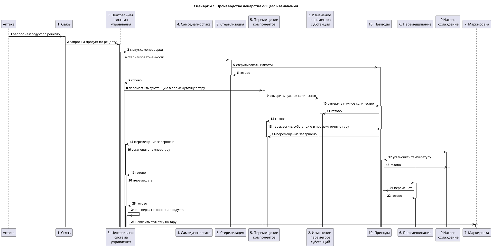

# Робот-фармацевт
Учебный пример для курса по кибериммунной разработке

- [Учебный пример "Робот-фармацевт.](#Учебный-пример-"Робот-Фрамацевт") 
- [Краткое описание назначения и применения системы.](#Краткое-описание-назначения-и-применения-системы)
-  [Ключевые ценности, ущербы, неприемлемые события)](#Ключевые-ценности,ущербы,неприемлимые_события)
- [Контекст работы системы](#Контекст-работы-системы)
       - [Вариант 1 ](#Вариант-1)
       - [Вариант 2 ](#Вариант-1)
- [Основные функциональные сценарии.](#Основные-функциональные-сценарии) 
- [Высокоуровневая архитектура системы.](#Высокоуровневая-архитектура-системы) 
- [Компоненты:  описание подсистем](#Компоненты:-описание-подсистем)
- [Описание Сценариев (последовательности выполнения операций), при которых ЦБ нарушаются](#описание-сценариев-последовательности-выполнения-операций-при-которых-цб-нарушаются)
- [Указание "доверенных компонент" на архитектурной диаграмме.](#указание-доверенных-компонент-на-архитектурной-диаграмме)
- [Политики безопасности](#Политики-безопасности)
- [Анализ векторов атак и эффекта.](#Анализ-векторов-атак-и-эффекта-безопасности.)
- [Упражнение.](#Упражнение)

•	Учебный пример "Светофор"
•	Краткое описание проектируемой системы
•	Ключевые ценности, ущербы, неприемлемые события
•	Контекст
•	Основные функциональные сценарии
•	Высокоуровневая архитектура
•	Описание подсистем
•	Расширенные диаграммы функциональных сценариев
•	Цели и предположения безопасности
•	Цели безопасности
•	Предположения безопасности
•	Таблица соотнесения ценностей, неприемлемых событий и целей безопасности
•	Негативные сценарии
•	Политика архитектуры
•	Версия 1
•	Версия 2
•	Прототип системы

Учебный пример "Робот-фармацевт"

- [Учебный пример "Робот-фармацевт.](#Учебный пример "Робот - Фрамацевт") 
- [Краткое описание проектируемой системы](#Краткое описание проектируемой системы)
- [Ключевые ценности, ущербы, неприемлемые события)](#Ключевые ценности, ущербы, неприемлемые события)
- [Высокоуровневая архитектура системы](#Высокоуровневая архитектура-системы)
- [Компоненты](#компоненты)
- [АлгориКраткое описание проектируемой системы
- [Описание Сценариев (последовательности выполнения операций), при которых ЦБ нарушаются](#описание-сценариев-последовательности-выполнения-операций-при-которых-цб-нарушаются)
- [Указание "доверенных компонент" на архитектурной диаграмме.](#указание-доверенных-компонент-на-архитектурной-диаграмме)
- [Политики безопасности](#политики-безопасности)
- [Анализ векторов атак и эффекта.](Анализ векторов атак и эффекта (упражнение)
## Учебный пример "Робот-фармацевт

Робот-фармацевт

Продукт - робот-фармацевт, который производит лекарство по индивидуальному рецепту.
Рецепт включает в себя

а) точный состав и количество компонентов, порядок и условия изготовления конечного продукта

б) уникальный идентификатор лекарства, который изготавливается в определённом объёме для индивидуального курса лечения

Основные этапы процесса изготовления лекарства по рецепту

 

## Краткое описание назначения и применения системы

а) Робот-фармацевт управляется центральной системой по беспроводному интерфейсу

б) Робот-фармацевт передаёт состояние в центральную систему

Ценности продукта и негативные события в их отношении
|Ценность|	Негативное событие|	Величина ущерба|	Комментарий|
|----|----|----|----|
|Лекарство|Нарушение технологического процесса	|Высокий|возможно причинение вреда здоровью клиентов|
|Рецептура	| Неавторизованный доступ к рецептуре (раскрытие торгового секрета)	|Высокий|конкуренты смогут производить аналоги|
|Персональные данные|Неавторизованный доступ к персональным данным клиентов|Высокий|оборотный штраф для организации|
|Робот|невозможность производства лекарства из-за отказа оборудования|Средний	|при необходимости сотрудник фармацевт сможет вручную приготовить небольшие партии лекарств|
|Люди	|отравление из-за приёма неправильного лекарства|Высокий|возможно причинение вреда здоровью клиентов||

Роли пользователей
 - Оператор-фармацевт - вводит задание на производство и получает лекарство для передачи клиенту 

 - Пациент - получает рецепт от врача в клинике и по этому рецепту получает лекарство в аптеке

## Контекст работы системы
 ### Вариант 1. Лекарства общего назначения

 - Не предполагает льготного получения, не является наркотиком, не предполагает существенных ограничений для клиентов.
Однако лекарство может быть очень дорогим или с очень коротким сроком годности, поэтому клиенту важно получить свежее лекарство в минимально достаточной дозировке

Упрощение

Чтобы не отвлекаться на систему управления складскими запасами предположим, что это реализовано на уровне аптечной сети - только тем роботам будет передано задание на производство, которые располагают достаточным запасом субстанций

 ### Вариант 2. Лекарства из специального списка
Варианты
-	входит в список жизненно-необходимых, производство полностью или частично оплачивается государством

-	содержит наркотические вещества или прекурсоры для их получения, авторизованное получение такого лекарства должно строго контролироваться
-	всё остальное из варианта 1.

  

 ## Цели и предположения безопасности
 
Цели безопасности

 - Выполняются только аутентичные задания на производство
 
Предположения безопасности

- "доктор плохого не посоветует" - врачи, выписывающие рецепты, благонадёжны.
 
## Компоненты:  описание подсистем
| Название | Назначение | Комментарий |
|----|----|----|
|*1. Связь*|	отвечает за взаимодействие с системой распределения задач на изготовление и с базой данных рецептов|	получает полный рецепт или его идентификатор|
|*2. Измерение параметров субстанций*|контролирует массу и/или объём компонентов| 	---|
|*3. Центральная система управления*|	осуществляет общее управление процессом приготовления лекарства	|---|
|*4. Самодиагностика*|	осуществляет сбор и анализ телеметрии всех подсистем для оценки работоспособности системы|---|	
|*5. Перемещение компонентов*|	отвечает за расчёт траекторий перемещения робота на каждом этапе тех. процесса|	---|
|*6. Перемешивание*|осуществляет комплекс действий для достижения требуемого уровня смешения компонентов|	используется в том числе для подготовки промежуточных ёмкостей|---|
|*7. Маркировка*|изготавливает и наклеивает на ёмкость описание лекарства	|---|
|*8. Стерилизация*|осуществляет комплекс действий по стерилизации ёмкости с лекарством|включает контроль качества стерилизации|
|*9. Нагрев/охлаждение*|	обеспечивает требуемые по тех. процессу температурные условия для химических реакций|---|
|*10. Приводы*|	управляют захватами робота для реализации рассчитанных траекторий и механических воздействий на субстанции (в т.ч. измельчение и перемешивание)	|---|

### Основные функциональные сценарии получения лекарства
 Сценарий генерации событий
)
 
### Описание Сценариев (последовательности выполнения операций), при которых ЦБ нарушаются

https://www.planttext.com/?text=hLLDRzf04BtxLwouHet03WPwgF93Ud4fKf42HTX4wYs0cgOg3JtsqAhAfUUDMnBAvr_O_KTzCsCS6wkHYCe1p7hUctblPdTFmoZeHuFEcIeDmbOp25jXoN6YTdJMKYLpOo_DpAoDjXTcRlweoh4oF_2ymRzx4-FtjntQ4JqfiqJeWaAJ9Qtm_jP-nF8lUWyQW8Zi0vFExHIfUaZVRhPxGJT2mYzc2oppb5GGgjwReDy9ck_oOLJ6ZOdjrDpR2SU5vtjC7a9-KXexGhtQBEs4KqzVTfKT8lUGywoCfeKnqb9Kp2AaDABrygGdd5S31U6mG4FOscoOQvxMV987rGb4oTZ39JkduUikHpqVNYMBEPYgcx5zACZCK2TIRB2unVTQjE4fPfPgdiK5orSaMZ4wOL14iULcQkOUSIjZjWGUtB8G3TvBwZRpkdlEbvC9c2VT_yHHbN8-pDyJSSNnMifWX9y7D8xDTxAJ4LGGN7qFixIvWzEp3B2H1zQGwHjBMi1HbfCsekO4W-XjTz1vrUfZF99HKizUO5oEZfuhQWGt7XtayLJo3xB6Pc57PDP6KKcy3J2PTko4vo3mdWm_eVGC5xDf4N2Cf8pLDj4m4qMEH_7rD3uxH1H6-8bYbnUxGNJgXAcK3mDLocacsguoMcOZP5vXcUkgyl8sqsZcOlhYHDbhPUATHpIOTv0EFXm7QpnTA_RZ0YPLYTnbSigu4WLIDK8n4zXrc6VU3z151yhk77BS1_LFG8iDRa6l-w0tkrpD9Fl_FaWnHPVJCq5caAS5UumMavAymp3SpGPX58sZrCeI4n5oLWgVp2pLrqZL7u8ILP8jPsRZaL7p2uAkP8uT_nyjsBsNT7w1rdyaMs9VRY_gR5nwwk_jUQE5eCO4TECj-4f93FcSN1GuUX4zbbCZRJTzJblTrxYD_m80

**Отдельная диаграмма для первого негативного сценария - Verifier не проверил файл обновления:**

Упрощение
Чтобы не отвлекаться на систему управления складскими запасами предположим, что это реализовано на уровне аптечной сети - только тем роботам будет передано задание на производство, которые располагают достаточным запасом субстанций
 
задание на производство для конкретного робота-фармацевта

Робот-фармацевт
 
запрос рецепта рецепт

База данных рецептов

Вариант 2. Лекарства из специального списка
варианты
-	входит в список жизненно-необходимых, производство полностью или частично оплачивается государством

-	содержит наркотические вещества или прекурсоры для их получения, авторизованное получение такого лекарства должно строго контролироваться
-	всё остальное из варианта 1.

задание на производство для конкретного робота-фармацевта

Робот-фармацевт
 

запрос рецепта рецепт
 
База данных рецептов (переделать ссылку)
https://github.com/SvPolyanskaya/CyberImmunity/blob/Robot-in-Pharmacy/Нарушение%20связи.png
 
	
 ### Алгоритм работы решения
  
### Анализ векторов атак и эффекта 
| Название | Назначение | Результат атаки |
|----|----|----| 
|1. Связь|	отвечает за взаимодействие с системой распределения задач на изготовление и с базой данных рецептов|в результате компрометации произошла подмена задания на производство|
|2. Измерение параметров субстанциЙ|контролирует массу и/или объём компонентов	||
|3. Центральная система управления|осуществляет общее управление процессом приготовления лекарства||
|4. Самодиагностика|осуществляет сбор и анализ телеметрии всех подсистем для оценки работоспособности системы||
|5. Перемещение компонентов|отвечает за расчёт траекторий перемещения робота на каждом этапе тех. процесса||
|6. Перемешивание|осуществляет комплекс действий для достижения требуемого уровня смешения компонентов||
|7. Маркировка|изготавливает и наклеивает на ёмкость описание лекарства	||
|8. Стерилизация|осуществляет комплекс действий по стерилизации ёмкости с лекарством||
|9. Нагрев/охлаждение|обеспечивает требуемые по тех. процессу температурные условия для химических реакций||
|10. Приводы|	управляют захватами робота для реализации рассчитанных траекторий и механических воздействий на субстанции (в т.ч. измельчение и перемешивание)	||
 ### Упражнение
Используя пример выше, изобразите развитие атаки через другие скомпрометированные компоненты (по одному в сценарии)

Если в результате развития атаки можно нарушить какую-либо ЦБ, то компонент обязан стать частью доверенной кодовой базы, если нет, то его следует рассматривать как недоверенный код.

Цели безопасности
1.	Выполняются только аутентичные задания на производство

2.	Для производства используются только авторизованные вещества

3.	Продукт имеет аутентичную маркировку

Предположения безопасности
- "доктор плохого не посоветует" - врачи, выписывающие рецепты, благонадёжны
 
Политика архитектуры

Легенда
недоверенная сущность

доверенная сущность

доверенная сущность,
повышающая целостность данных

высокоцелостные данные

низкоцелостные данные

Качественные оценки доменов
Сложность - S (simple), M(medium), C (complex) - простой, средней сложности, сложный
Размер (объём) кода - S, M, L, XL - маленький, среднего размера, большой, очень большой
- простой и маленький
 
 Обоснование уровня доверия доменов безопасности
| Домен безопасности | Уровень доверия	 | Обоснование |Комментарий|
|----|----|----| ----|
|1. Связь|недоверенный|   |    |
|2. Измерение параметров субстанций|недоверенный|   |    |
|3. Центральная система управления|недоверенный|   |    |
|4. Самодиагностика|недоверенный|   |    |	
|5. Перемещение компонентов|недоверенный|   |    |	
|6. Перемешиваниея|недоверенный|   |    |	
|7. Маркировка	|недоверенный|   |    |
|8. Стерилизация	|недоверенный|   |    |
|9. Нагрев/охлаждение|недоверенный|   |    |	
|10. Приводы	|недоверенный|   |    |
 
Домашнее задание: переработка политики архитектуры

Критерии хорошей политики архитектуры:

-	минимизировать размер и сложность TCB под заданные ЦПБ 1-3
-	обоснование уровня доверия приведено в таблице 1.
-	минимальное количество интерфейсов у доверенных компонентов

Другими словами
-	каждый доверенный домен безопасности, особенно "жёлтый", нужно стремиться делать простым и маленьким, количество входящих стрелок следует стремиться сделать минимальным

Что можно сделать
-	декомпозировать существующие домены безопасности
-	добавить новые домены безопасности, обеспечивающие достижение ЦБ при уменьшении размера довереной кодовой базы
-	следует заполнить таблицу 2 на следующей вкладке с описанием новых доменов безопасности и заполнить таблицу 3 с обоснованием выбора уровня доверия

